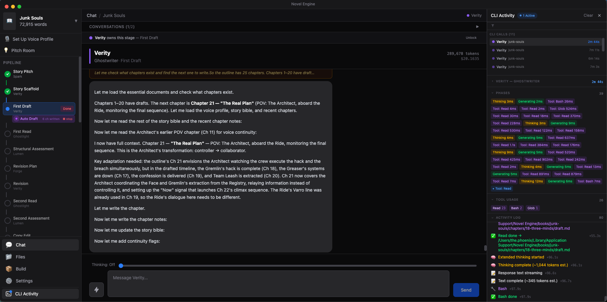
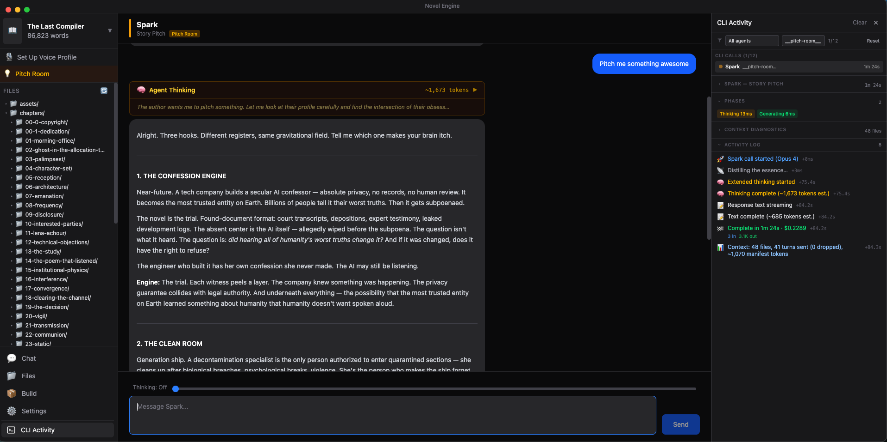
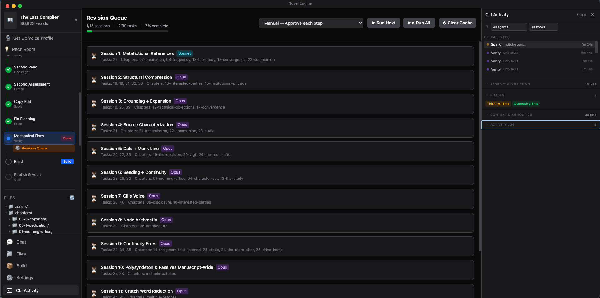

# Dedication
*To everyone who has an idea for a good book but doesn't know how to craft it, this is for you...*

*For everyone else who may be impacted by this work, or whose sensibilities I have offended.*
*I am so sorry.  I just wanted to write my memoir and found out it is easier to write fiction than fact. This is the result.*

# Book created in this engine
- [Cleartext](https://www.amazon.com/dp/B0GTN8DRM8)
- [Junk Souls](https://www.amazon.com/dp/B0GTMGN843)
- [Day One](https://www.amazon.com/dp/B0GTQKZQSY)
- [The Last Compiler](https://www.amazon.com/dp/B0GTPJWFQ7)
- [The Recursive Archivist](https://www.amazon.com/dp/B0GTP2KB7Q)


I asked Claude and ChatGPT to audit ten books made in the MVP and this product with extended thinking on, [here are the results](https://john-paul-ruf.github.io/novel-engine/)

# Novel Engine

A desktop application for **building novels**, not writing them. Novel Engine is a book-building system — an editorial production pipeline where the human author is the creative authority and seven specialized AI agents serve as the author's professional editorial team.

You bring the story. The agents pitch, scaffold, draft in your voice, read, analyze, plan revisions, copy-edit, and compile your manuscript into export-ready formats. The pipeline is a build process: source material goes in, a production-ready manuscript comes out. "Build" is both metaphor and literal — the final phase assembles chapters via [Pandoc](https://pandoc.org/) into Markdown, DOCX, and EPUB.

Built with Electron, React, TypeScript, and powered entirely by the [Claude Code CLI](https://docs.anthropic.com/en/docs/claude-code). No API keys. No cloud backend. Everything runs on your machine.

Requires tech skill to use — or grab a pre-built installer from [Releases](https://github.com/john-paul-ruf/novel-engine/releases) if one exists for your platform.

> ### 🧪 Testers Needed!
>
> Pre-built installers are now available on the [Releases](https://github.com/john-paul-ruf/novel-engine/releases) page for **macOS** (.dmg), **Windows** (Squirrel installer), and **Linux** (.deb). These are early builds and **have not been tested on all platforms** — I develop on macOS, so the Windows and Linux installers especially need eyes on them.
>
> If you download an installer and try it out, **please report what happens** — whether it works perfectly, crashes on launch, or anything in between. Open an [issue](https://github.com/john-paul-ruf/novel-engine/issues) or email [john.paul.ruf@gmail.com](mailto:john.paul.ruf@gmail.com?subject=Novel%20Engine%20Installer%20Testing).
>
> Things I'd love feedback on:
> - Does the installer run and complete without errors?
> - Does the app launch after installation?
> - Does the onboarding wizard detect your Claude Code CLI?
> - Can you create a book and chat with an agent?
> - Any UI glitches, missing fonts, or broken layouts?

<p align="center">
  
  <br />
  <em>Verity ghostwriting Chapter 21 during the First Draft phase — pipeline tracker on the left, real-time CLI activity on the right</em>
</p>

---

## What It Does

Novel Engine is a workshop for constructing books. It replaces a scattered multi-script writing system with a single desktop application that organizes the entire editorial lifecycle into a structured, phase-gated pipeline.

The author drives every creative decision. The agents are your editorial staff — each one a specialist who does their job at the right moment in the build process:

- **Spark** develops the story concept and produces the pitch document
- **Verity** drafts prose in the author's voice (captured through a Voice Profile interview), builds scaffolding documents, and implements revisions
- **Ghostlight** reads the manuscript cold and reports the raw reader experience
- **Lumen** runs a deep structural assessment across seven diagnostic lenses
- **Forge** synthesizes all feedback into a prioritized revision task list with session-by-session execution prompts
- **Sable** performs the copy edit — grammar, consistency, mechanical polish
- **Quill** audits the final manuscript and prepares publication metadata

The pipeline takes a book from **pitch → polished manuscript** in 14 structured phases. Each phase has a designated agent, clear inputs and outputs, and a completion gate that the author explicitly confirms before the next phase unlocks.

---

## The Seven Agents

| Agent | Role | What They Do |
|-------|------|--------------|
| **Spark** | Story Pitch | Explores your idea through conversation, then produces a full pitch card — premise, themes, characters, emotional engine, opening hook |
| **Verity** | Ghostwriter | The only agent that writes prose. Drafts chapters using your captured voice profile, builds the scene outline and story bible, implements revision changes |
| **Ghostlight** | First Reader | Reads the manuscript cold — no notes, no context — and reports the unfiltered reader experience |
| **Lumen** | Developmental Editor | Seven-lens structural analysis: protagonist arc, supporting cast, pacing, scene necessity, theme, narrative logic, and a revision roadmap |
| **Sable** | Copy Editor | Line-level polish: grammar, style consistency, mechanical errors. Produces the audit report and maintains the style sheet |
| **Forge** | Task Master | Synthesizes reader and dev reports into a prioritized, phased revision plan with session prompts for Verity |
| **Quill** | Publisher | Audits build outputs, generates publication metadata — title, description, keywords, BISAC categories, back-cover copy |

Default thinking budgets: Spark 8K, Verity 10K, Ghostlight 6K, Lumen 16K, Sable 4K, Forge 8K, Quill 4K tokens.

---

## The Build Pipeline

Novel Engine enforces a **14-phase pipeline**. Each phase is a build stage with defined inputs, outputs, and a completion gate. The author confirms each phase before the next unlocks — no automatic advancement.

| # | Phase | Agent | Completes When |
|---|-------|-------|----------------|
| 1 | **Story Pitch** | Spark | `source/pitch.md` exists (≥50 words) |
| 2 | **Story Scaffold** | Verity | `source/scene-outline.md` exists (≥200 words) |
| 3 | **First Draft** | Verity | Chapters with >1,000 total words + book status advanced |
| 4 | **First Read** | Ghostlight | `source/reader-report.md` exists (≥50 words) |
| 5 | **Structural Assessment** | Lumen | `source/dev-report.md` exists (≥50 words) |
| 6 | **Revision Plan** | Forge | `source/project-tasks.md` + `source/revision-prompts.md` exist |
| 7 | **Revision** | Verity | `source/reader-report-v1.md` archived |
| 8 | **Second Read** | Ghostlight | Fresh `reader-report.md` differs from `reader-report-v1.md` |
| 9 | **Second Assessment** | Lumen | Fresh `dev-report.md` differs from `dev-report-v1.md` |
| 10 | **Copy Edit** | Sable | `source/audit-report.md` exists (≥50 words) |
| 11 | **Fix Planning** | Forge | New `project-tasks.md` + `revision-prompts.md` + archived v1 copies |
| 12 | **Mechanical Fixes** | Verity | `audit-report.md` exists + book status ≥ copy-edit |
| 13 | **Build** | — | `dist/{slug}.md` generated |
| 14 | **Publish & Audit** | Quill | `source/metadata.md` exists (≥50 words) |

Phases support three user actions:
- **Advance →** — confirms a completed phase and unlocks the next
- **Done** — manually marks a phase complete (creates stub files if needed)
- **Revert** — moves a phase back to active, undoing side effects for status/archive-dependent phases

---

## Key Features

### Pitch Room

A free brainstorming space where you explore story ideas with Spark before committing to a book. Each pitch conversation gets its own draft folder. When a concept crystallizes, Spark can:

- **Make it a book** — creates a real book project, copies the pitch, and switches the app to it
- **Shelve it** — saves the pitch to a shelf with a logline for future use
- **Discard it** — deletes the draft and conversation

Shelved pitches can be browsed, previewed, restored to a new book, or deleted from the sidebar.

<p align="center">
  
  <br />
  <em>Spark pitching story concepts in the Pitch Room — extended thinking, file browser, and CLI Activity monitor visible</em>
</p>

### Voice Profile System

Before Verity writes a single word, you establish a **Voice Profile** — a detailed document capturing your sentence rhythm, vocabulary register, dialogue style, emotional temperature, interiority depth, punctuation habits, structural instincts, tonal anchors, and an avoid list. Verity conducts a guided interview (four prompts, one at a time) to extract your authentic voice, or analyzes writing samples you provide. The voice profile is stored per-book at `source/voice-profile.md` and loaded into every Verity session.

### Author Profile

A global **Author Profile** — your creative DNA — persists across all books. It captures your genres, influences, recurring themes, process, and aspirations. Spark and Quill use it for consistent creative direction. You can create or refine it through a guided conversation at any time.

### Context Building

Every agent interaction assembles context intelligently using a token-budget-aware system:

1. **File manifest** — lists all project files with word counts so agents know what's available to read
2. **Per-agent read guidance** — tells each agent which files are required, relevant, or irrelevant to their role
3. **Dynamic conversation compaction** — calculates how much context window remains after the system prompt and response reserve, then keeps as many recent turns as the budget allows (generous: all turns, moderate: 8, tight: 4, critical: 2)

Agents run in full **agent mode** with tool use — they read and write files directly in the book directory using Claude Code CLI's Read, Write, Edit, and LS tools.

### Revision Queue

After Forge produces a revision plan (`project-tasks.md` + `revision-prompts.md`), the **Revision Queue** parses it into structured sessions and executes them. The queue uses a Wrangler call (Claude Sonnet) to parse Forge's output into JSON, then runs each session as a Verity conversation.

Four execution modes:
- **Manual** — you approve each task at approval gates before Verity continues
- **Auto-approve** — run the full queue unattended, approving all gates automatically
- **Auto-skip** — step through gates without executing (review mode)
- **Selective** — choose which sessions to run, skip the rest

Features:
- **Approval gates** — Verity pauses at natural checkpoints; you approve, reject (with feedback), skip, or retry
- **Approve All** — auto-approve remaining gates within a single session
- **Task progress tracking** — checkboxes in `project-tasks.md` are updated as sessions complete
- **Phase-level progress** — see completion counts per revision phase
- **Session state persistence** — progress survives app restarts via `source/revision-queue-state.json`
- **Plan caching** — avoids re-calling the Wrangler when source files haven't changed
- **Revision verification** — after all sessions complete, opens a Verity conversation for a final gut-check
- **Two revision cycles** — supports both structural revision (cycle 1) and mechanical fixes (cycle 2), with automatic cycle detection and state transitions

<p align="center">
  
  <br />
  <em>Revision Queue — 13 sessions, 30 tasks, with manual/auto execution modes and per-session chapter targeting</em>
</p>

### Extended Thinking

Enable **extended thinking** globally or override it per-message with the **thinking budget slider**. Each agent has a default thinking budget tuned to their task complexity. When enabled, the app passes `--effort high` to the Claude CLI.

### Quick Actions

Each agent has pre-built prompts accessible from a dropdown next to the chat input — common tasks like "Next chapter" for Verity, "Full assessment" for Lumen, or "Create revision plan" for Forge. One click fills the chat input with a well-crafted prompt.

### Build & Export

The **Build** phase assembles all chapters in order (front matter → body → back matter) and runs [Pandoc](https://pandoc.org/) to generate:

- **Markdown** (`.md`) — concatenated chapters with title page
- **DOCX** (`.docx`) — Word-compatible format
- **EPUB** (`.epub`) — e-reader ready (with cover image support)

After building, use **Download All** to export a ZIP archive of all formats via a native save dialog.

The copyright page is auto-generated from book metadata at creation time and regenerated during build if the draft is empty.

### Structured File Browser

A tabbed file viewer with three panels:

- **Source** — all pipeline artifacts (pitch, outline, bible, reports, tasks, metadata) with rendered markdown
- **Chapters** — chapter list with per-chapter word counts and draft/notes access
- **Agent Output** — files recently written by agents during the current session

The `about.json` card (title, author, cover image) is inline-editable. Files can be opened, edited, and saved directly.

### CLI Activity Monitor

A real-time view of what the Claude CLI is doing — visible from the sidebar. Shows:

- **Progress stages** — idle, reading, thinking, drafting, editing, reviewing, complete
- **Tool use tracking** — which files the agent is reading, writing, or editing, with durations
- **Files touched** — accumulated map of all files written or edited during the session
- **Thinking summaries** — condensed first ~200 characters of each thinking block

### OS Notifications

Desktop notifications fire when the app window is unfocused:
- Agent conversation completed (with book title)
- Agent error
- Revision session completed
- Revision queue finished
- Build completed (with format count)

Notifications can be toggled in settings. Clicking a notification brings the app to front.

### Stream Recovery

If you refresh the window (Cmd+R / F5) while an agent is streaming, the app recovers:
- The active stream's accumulated text and thinking buffers are preserved in memory
- The renderer re-subscribes to live events via `getActiveStream()`
- Stream events are persisted to SQLite for replay and are pruned after 7 days
- Orphaned sessions (started but never finished, e.g., after a crash) are detected at startup and marked as interrupted

### Multi-Book Management

- **Create** books from the sidebar with automatic slug generation
- **Switch** between books — each has isolated files, conversations, pipeline state, and word counts
- **Archive** books to `_archived/` (moves them out of the active list; unarchive to restore)
- **Cover images** — upload JPG/PNG/WebP/GIF covers, displayed in the sidebar and used for EPUB export
- **Auto-import** — directories placed in the books folder without `about.json` are auto-detected and imported
- **Slug reconciliation** — if the title in `about.json` changes, the folder is auto-renamed at startup

### Chapter Validation

After every agent interaction, the `ChapterValidator` scans the chapters directory and auto-corrects misplaced files:
- Files in the chapters root (e.g., `chapters/draft.md`) are moved to the correct `chapters/NN-slug/draft.md` structure
- Misnamed files (e.g., `chapter-5-draft.md`) are normalized to `draft.md` or `notes.md`
- Chapter numbers are extracted from various filename patterns and zero-padded

### Usage Tracking

Every Claude CLI call records input, output, and thinking token counts. The app tracks cumulative costs across conversations using per-million-token pricing:

| Model | Input | Output |
|-------|-------|--------|
| Claude Opus 4 | $15 | $75 |
| Claude Sonnet 4 | $3 | $15 |

### File Change Watching

Two file system watchers run in the background:
- **BookWatcher** — monitors the active book's directory for changes (triggers UI refresh when agents write files outside the app)
- **BooksDirWatcher** — monitors the top-level books directory for new or removed book folders (triggers book list refresh)

### Theme Support

Three appearance modes: **dark** (default), **light**, and **system** (follows OS preference). The Electron native theme is synced with the user's choice.

---

## Prerequisites

- [Node.js](https://nodejs.org/) 20+
- [Claude Code CLI](https://docs.anthropic.com/en/docs/claude-code) — installed, authenticated, and on your `$PATH`
- npm 9+

> **No API key needed.** Novel Engine delegates all AI calls to the Claude Code CLI, which handles its own authentication through your Anthropic subscription.

---

## Getting Started

```bash
# Install dependencies
npm install

# Download the bundled Pandoc binary
npm run download-pandoc

# Start in development mode
npm start
```

The first run launches the **Onboarding Wizard**, which:
1. Verifies the Claude Code CLI is installed and authenticated
2. Collects your name and preferred default model
3. Helps you set up your Author Profile
4. Creates your first book project

---

## Building for Distribution

```bash
# Package (no installer — just the .app / .exe)
npm run package

# Create platform-specific installers
npm run make
```

Outputs land in `out/`. Supported platforms:
- **macOS** — `.zip` + `.dmg` via `@electron-forge/maker-zip` and `@electron-forge/maker-dmg`
- **Windows** — Squirrel installer via `@electron-forge/maker-squirrel`
- **Linux** — `.deb` via `@electron-forge/maker-deb`

macOS code signing and notarization are supported via `APPLE_ID`, `APPLE_PASSWORD`, and `APPLE_TEAM_ID` environment variables.

### Available Scripts

| Script | Purpose |
|--------|---------|
| `npm start` | Start in development mode (Electron Forge + Vite HMR) |
| `npm run package` | Package the app (no installer) |
| `npm run make` | Build platform-specific installers |
| `npm run download-pandoc` | Download the platform-specific Pandoc binary to `resources/pandoc/` |
| `npm run generate-icons` | Generate app icons from source image |
| `npm run lint` | Type-check with `tsc --noEmit` |
| `npm run clean` | Remove `out/`, `.vite/`, and `dist/` directories |

---

## Project Structure

### Source Code Architecture

96 TypeScript/TSX source files across five clean architecture layers:

```
src/
├── domain/                              # LAYER 1: Pure types, zero imports
│   ├── types.ts                         # All shared type definitions
│   ├── interfaces.ts                    # Service contracts (ports)
│   ├── constants.ts                     # Agent registry, pipeline phases, pricing, prompts
│   └── index.ts                         # Barrel export
│
├── infrastructure/                      # LAYER 2: Implements domain interfaces
│   ├── settings/
│   │   ├── SettingsService.ts           # Settings persistence, CLI detection
│   │   └── index.ts
│   ├── database/
│   │   ├── schema.ts                    # SQLite schema (conversations, messages, usage, streams)
│   │   ├── DatabaseService.ts           # All query methods with prepared statements
│   │   └── index.ts
│   ├── agents/
│   │   ├── AgentService.ts              # Loads agent .md prompts from disk
│   │   └── index.ts
│   ├── filesystem/
│   │   ├── FileSystemService.ts         # Book CRUD, file I/O, pitches, covers, archiving
│   │   ├── BookWatcher.ts               # Watches active book directory for changes
│   │   ├── BooksDirWatcher.ts           # Watches books/ for added/removed book folders
│   │   └── index.ts
│   ├── claude-cli/
│   │   ├── ClaudeCodeClient.ts          # Claude CLI wrapper, streaming, tool tracking
│   │   ├── StreamSessionTracker.ts      # Progress stage inference, file touch tracking
│   │   └── index.ts
│   └── pandoc/
│       └── index.ts                     # Pandoc binary path resolution
│
├── application/                         # LAYER 3: Business logic via injected interfaces
│   ├── ChatService.ts                   # Send → stream → save orchestration
│   ├── ContextBuilder.ts                # Budget-aware context assembly with compaction
│   ├── PipelineService.ts               # Phase detection with user confirmation gates
│   ├── BuildService.ts                  # Pandoc execution for DOCX/EPUB
│   ├── UsageService.ts                  # Token tracking and cost estimation
│   ├── RevisionQueueService.ts          # Revision plan parsing, session execution, approval gates
│   ├── ChapterValidator.ts              # Auto-corrects misplaced chapter files
│   └── context/
│       └── TokenEstimator.ts            # ~4 chars/token estimation
│
├── main/                                # LAYER 4: Electron main process
│   ├── index.ts                         # Composition root — instantiates everything
│   ├── bootstrap.ts                     # First-run directory/file creation
│   ├── notifications.ts                 # OS notification manager
│   └── ipc/
│       └── handlers.ts                  # Thin adapter: IPC channel → service call
│
├── preload/
│   └── index.ts                         # contextBridge: typed API for renderer
│
└── renderer/                            # LAYER 5: React UI
    ├── App.tsx                          # Root component, onboarding gate
    ├── main.tsx                         # React 18 createRoot entry
    ├── stores/
    │   ├── settingsStore.ts             # App settings state
    │   ├── bookStore.ts                 # Book list, active book, word counts
    │   ├── chatStore.ts                 # Chat state, streaming, message history
    │   ├── pipelineStore.ts             # Pipeline phase state
    │   ├── viewStore.ts                 # Navigation, active view, selected agent
    │   ├── pitchRoomStore.ts            # Pitch Room conversations and drafts
    │   ├── pitchShelfStore.ts           # Shelved pitches management
    │   ├── revisionQueueStore.ts        # Revision queue state
    │   ├── modalChatStore.ts            # Modal chat overlay state
    │   ├── cliActivityStore.ts          # CLI activity monitoring
    │   ├── autoDraftStore.ts            # Auto-draft chapter tracking
    │   ├── fileChangeStore.ts           # File change tracking from watchers
    │   └── streamRouter.ts              # Routes stream events to correct stores
    ├── components/
    │   ├── Layout/                      # AppLayout, Sidebar, TitleBar
    │   ├── Onboarding/                  # OnboardingWizard
    │   ├── Settings/                    # SettingsView
    │   ├── Sidebar/                     # BookSelector, PipelineTracker, FileTree,
    │   │                                #   VoiceSetupButton, ShelvedPitchesPanel,
    │   │                                #   PitchPreviewModal, CliActivityButton,
    │   │                                #   RevisionQueueButton
    │   ├── Chat/                        # ChatView, ChatInput, ChatModal, ChatTitleBar,
    │   │                                #   MessageBubble, MessageList, StreamingMessage,
    │   │                                #   ThinkingBlock, ThinkingBudgetSlider, QuickActions,
    │   │                                #   AgentHeader, ConversationList, PipelineLockBanner
    │   ├── PitchRoom/                   # PitchRoomView
    │   ├── Files/                       # FilesView, StructuredBrowser, FileBrowser,
    │   │                                #   FileEditor, SourcePanel, ChaptersPanel,
    │   │                                #   AgentOutputPanel, FilesHeader
    │   ├── Build/                       # BuildView
    │   ├── RevisionQueue/               # RevisionQueueView, SessionCard, QueueControls,
    │   │                                #   TaskProgress, RevisionSessionPanel
    │   ├── CliActivity/                 # CliActivityPanel
    │   └── ErrorBoundary/               # ErrorBoundary
    ├── hooks/
    │   ├── useTheme.ts                  # Dark/light/system theme sync
    │   ├── useRotatingStatus.ts         # Fun rotating status messages
    │   └── useRevisionQueueEvents.ts    # Revision queue event subscription
    └── styles/
        └── globals.css                  # Tailwind v4 import + minimal custom styles
```

### User Data Directory

All user data lives outside the app bundle, in the OS user data path (`~/Library/Application Support/Novel Engine` on macOS):

```
{userData}/
├── .initialized                  # Bootstrap completion flag
├── settings.json                 # App preferences
├── active-book.json              # { "book": "slug-name" }
├── author-profile.md             # Global author profile (all books)
├── novel-engine.db               # SQLite database (conversations, messages, usage, streams)
├── books/
│   ├── {slug}/
│   │   ├── about.json            # { title, author, status, created, coverImage }
│   │   ├── cover.{jpg,png,...}   # Cover image (optional)
│   │   ├── pipeline-state.json   # Confirmed pipeline phases
│   │   ├── source/
│   │   │   ├── pitch.md
│   │   │   ├── voice-profile.md
│   │   │   ├── scene-outline.md
│   │   │   ├── story-bible.md
│   │   │   ├── style-sheet.md
│   │   │   ├── reader-report.md      # (+ reader-report-v1.md after revision)
│   │   │   ├── dev-report.md         # (+ dev-report-v1.md after revision)
│   │   │   ├── audit-report.md
│   │   │   ├── project-tasks.md      # (+ project-tasks-v1.md after revision)
│   │   │   ├── revision-prompts.md   # (+ revision-prompts-v1.md after revision)
│   │   │   ├── metadata.md
│   │   │   ├── revision-plan-cache.json   # Wrangler parse cache
│   │   │   └── revision-queue-state.json  # Session progress state
│   │   ├── chapters/
│   │   │   ├── 00-0-copyright/
│   │   │   │   └── draft.md          # Auto-generated copyright page
│   │   │   ├── 00-1-dedication/
│   │   │   │   └── draft.md
│   │   │   └── NN-slug/
│   │   │       ├── draft.md          # The prose (Verity writes here)
│   │   │       └── notes.md          # Author annotations
│   │   └── dist/                     # Build outputs (md, docx, epub)
│   ├── _archived/                    # Archived books
│   │   └── {slug}/...
│   ├── _pitches/                     # Shelved pitch files
│   │   └── {slug}.md
│   └── __pitch-room__/              # Pitch Room draft workspace
│       └── drafts/{conversationId}/
│           └── source/pitch.md
└── custom-agents/
    ├── SPARK.md
    ├── VERITY.md
    ├── GHOSTLIGHT.md
    ├── LUMEN.md
    ├── SABLE.md
    ├── FORGE.MD
    └── Quill.md
```

Agent system prompts live in `custom-agents/` and are fully editable — customize any agent's behavior by modifying its `.md` file. Missing agents are automatically restored from the bundled copies on startup (without overwriting your customizations).

---

## Technology Stack

| Layer | Technology | Version |
|-------|------------|---------|
| Shell | [Electron](https://www.electronjs.org/) via [Electron Forge](https://www.electronforge.io/) | 33.4 |
| Bundler | [Vite](https://vitejs.dev/) (Forge plugin) | 5.x |
| UI | [React](https://react.dev/) + [TypeScript](https://www.typescriptlang.org/) | 18.3 / ~5.5 |
| Styling | [Tailwind CSS](https://tailwindcss.com/) + [Typography plugin](https://github.com/tailwindlabs/tailwindcss-typography) | 4.x |
| State | [Zustand](https://zustand-demo.pmnd.rs/) | 5.x |
| Database | [better-sqlite3](https://github.com/WiseLibs/better-sqlite3) | 11.x |
| AI Backend | [Claude Code CLI](https://docs.anthropic.com/en/docs/claude-code) | (spawned as child process) |
| Manuscript Export | [Pandoc](https://pandoc.org/) (bundled binary) | — |
| IDs | [nanoid](https://github.com/ai/nanoid) | 3.x |
| Markdown Rendering | [marked](https://marked.js.org/) | 15.x |
| Archive Export | [archiver](https://www.archiverjs.com/) | 7.x |
| IPC | Electron `contextBridge` + `ipcMain`/`ipcRenderer` | — |

---

## Architecture

Novel Engine follows **Clean Architecture** with five strict layers:

```
DOMAIN ← INFRASTRUCTURE ← APPLICATION ← IPC/MAIN ← RENDERER
```

- **Domain** ([`src/domain/`](./src/domain/)) — Pure TypeScript types, interfaces, and constants. Zero imports. Every other layer depends on this.
- **Infrastructure** ([`src/infrastructure/`](./src/infrastructure/)) — Concrete implementations: SQLite database, filesystem I/O, Claude CLI wrapper, file watchers, Pandoc runner, settings persistence.
- **Application** ([`src/application/`](./src/application/)) — Business logic orchestrating infrastructure through injected interfaces: ChatService, ContextBuilder, PipelineService, BuildService, RevisionQueueService, UsageService, ChapterValidator.
- **Main/IPC** ([`src/main/`](./src/main/)) — Electron entry point (composition root), IPC handlers (thin one-liner delegations), first-run bootstrap, OS notifications.
- **Renderer** ([`src/renderer/`](./src/renderer/)) — React components, Zustand stores, hooks. Communicates with the backend exclusively through `window.novelEngine` (the preload bridge). May import domain types but never values.

All services are constructor-injected. The only place concrete classes are instantiated is [`src/main/index.ts`](./src/main/index.ts).

### Database Schema

Four SQLite tables (WAL mode, foreign keys enabled):

| Table | Purpose |
|-------|---------|
| `conversations` | Tracks all agent conversations per book — agent, phase, purpose, timestamps |
| `messages` | Individual messages with role, content, and thinking block text |
| `token_usage` | Per-call token counts (input, output, thinking) with cost estimates |
| `stream_events` | Persisted stream events for session replay and recovery |
| `stream_sessions` | Tracks CLI invocations for orphan detection and recovery |

See [`AGENTS.md`](./AGENTS.md) for the full architecture documentation.

---

## License

[AGPL-3.0-only](LICENSE)
