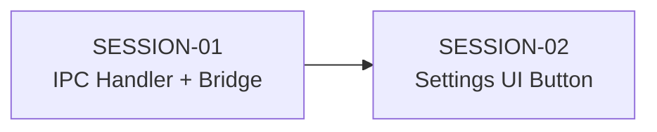

# Feature Build — State Tracker (catalog-export)

> Generated from intake documents on 2026-03-28.
> This file tracks progress across all session prompts.
> Updated by the agent at the end of each session execution.

---

## Feature

**Name:** catalog-export
**Intent:** Export all books as a single ZIP archive from the Settings view.
**Source documents:** `prompts/feature-requests/export-books.md`
**Sessions generated:** 2

---

## Status Key

- `pending` — Not started
- `in-progress` — Started but not verified
- `done` — Completed and verified
- `blocked` — Cannot proceed (see notes)
- `skipped` — Intentionally skipped (see notes)

---

## Session Status

| # | Session | Layer(s) | Status | Completed | Notes |
|---|---------|----------|--------|-----------|-------|
| 1 | SESSION-01 — IPC Handler + Preload Bridge | IPC | pending | | |
| 2 | SESSION-02 — Export Catalog Button in Settings UI | Renderer | pending | | |

---

## Dependency Graph

- SESSION-02 depends on SESSION-01 (needs the `catalog.exportZip` bridge method to exist)
- No parallelism — strictly sequential

---

## Scope Summary

### Domain Changes
- None

### Infrastructure Changes
- None

### Application Changes
- None

### IPC Changes
- New channel: `catalog:exportZip` (invoke, returns `string | null`)
- New preload bridge method: `window.novelEngine.catalog.exportZip()`

### Renderer Changes
- New component: `CatalogExportSection` in `SettingsView.tsx`

### Database Changes
- None

---

## Design Decisions

| Decision | Rationale |
|----------|-----------|
| No new service — handler is self-contained | The operation is purely mechanical (zip a directory). No business logic, no orchestration, no domain concepts. The existing `build:exportZip` handler follows the same pattern — a direct `archiver` call inside the handler. Creating a service would be over-engineering. |
| ZIP contains a top-level `books/` folder | When extracted, the user gets `books/{slug}/...` instead of loose slug directories. Clearer structure. |
| Default filename includes date | `novel-engine-catalog-2026-03-28.zip` makes it easy to identify backups. |
| Placed in Settings between Usage and Author Profile | Groups data/export concerns together. Settings is the canonical location per the feature request. |
| Uses `archiver` (already a dependency) | No new packages needed. Same library used by `build:exportZip`. |

---

## Handoff Notes

### Last completed session: (none yet)

### Observations:

### Warnings:
