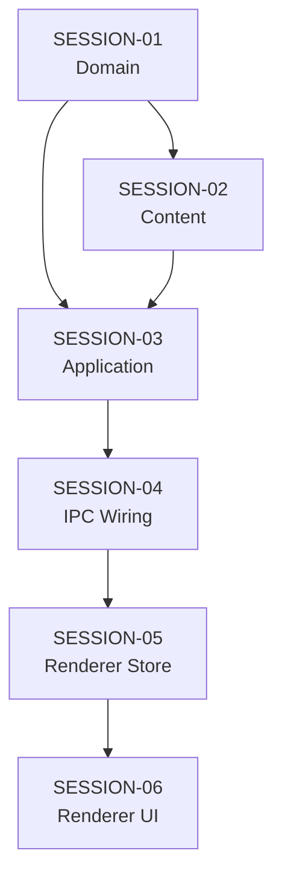

# Feature Build — State Tracker (helper-agent)

> Generated from intake documents on 2026-03-28.
> This file tracks progress across all session prompts.
> Updated by the agent at the end of each session execution.

---

## Feature

**Name:** helper-agent
**Intent:** Add an always-available in-app help assistant that answers user questions about Novel Engine using a comprehensive user guide as its knowledge base, accessible via a floating chat bubble in the lower-right corner.
**Source documents:** `prompts/feature-requests/helper-agent.md`
**Sessions generated:** 6

---

## Status Key

- `pending` — Not started
- `in-progress` — Started but not verified
- `done` — Completed and verified
- `blocked` — Cannot proceed (see notes)
- `skipped` — Intentionally skipped (see notes)

---

## Session Status

| # | Session | Layer(s) | Status | Completed | Notes |
|---|---------|----------|--------|-----------|-------|
| 1 | SESSION-01 — Domain: Helper Agent Types, Interface, and Constants | Domain | done | 2026-03-28 | Also added 'helper' to ChatModal PURPOSE_LABELS to fix Record<ConversationPurpose> type error. Added Helper to AGENT_RESPONSE_BUFFER. |
| 2 | SESSION-02 — Content: User Guide & Helper Agent Prompt | Content / Infrastructure | done | 2026-03-28 | Added ensureUserGuide to bootstrap.ts. Added ./docs to forge extraResource. Guide always overwrites on startup to stay current. |
| 3 | SESSION-03 — Application: HelperService Implementation | Application | done | 2026-03-28 | Used StreamManager pattern (like PitchRoomService) instead of manual accumulation. Used resolveThinkingBudget utility. |
| 4 | SESSION-04 — IPC Wiring: Handlers, Preload Bridge, Composition Root | IPC / Main | done | 2026-03-28 | Stream events tagged with callId/conversationId/source per existing pattern. StreamManager passed from composition root. |
| 5 | SESSION-05 — Renderer Store: helperStore | Renderer | done | 2026-03-28 | Follows modalChatStore pattern exactly. Uses createStreamHandler with alwaysCheckConversationId: true. |
| 6 | SESSION-06 — Renderer UI: Floating Help Button & Chat Panel | Renderer | done | 2026-03-28 | Created HelperButton, HelperPanel, HelperMessageList. Added to AppLayout with stream listener. |

---

## Dependency Graph

- All sessions are strictly sequential.
- SESSION-01 must complete first (domain types needed everywhere).
- SESSION-02 and SESSION-03 both depend on SESSION-01, but SESSION-03 also depends on SESSION-02 (the agent prompt file must exist for the service to reference it).
- No parallelism opportunities — each session builds on the previous.

---

## Scope Summary

### Domain Changes
- `AgentName` — add `'Helper'`
- `CreativeAgentName` — exclude `'Helper'`
- `ConversationPurpose` — add `'helper'`
- `AGENT_REGISTRY` — add `Helper` entry
- `HELPER_SLUG` — new constant
- `IHelperService` — new interface

### Infrastructure Changes
- `agents/HELPER.md` — new agent prompt file
- `src/main/bootstrap.ts` — copy USER_GUIDE.md to userData

### Application Changes
- `src/application/HelperService.ts` — new service implementing `IHelperService`

### IPC Changes
- New channels: `helper:getOrCreateConversation`, `helper:getMessages`, `helper:send`, `helper:abort`, `helper:reset`
- New preload bridge namespace: `window.novelEngine.helper`

### Renderer Changes
- New store: `helperStore.ts`
- New components: `Helper/HelperButton.tsx`, `Helper/HelperPanel.tsx`, `Helper/HelperMessageList.tsx`
- Modified: `Layout/AppLayout.tsx` (add helper components + stream listener)

### Database Changes
- None — uses existing `conversations` and `messages` tables with `HELPER_SLUG` as the book slug

---

## Design Decisions

| Decision | Rationale |
|----------|-----------|
| Add `'Helper'` to `AgentName` rather than a separate type | Consistent with architecture — all agents go through `AGENT_REGISTRY`. Excluded from `CreativeAgentName` so it doesn't appear in pipeline agent lists. |
| Use `HELPER_SLUG = '__helper__'` for conversations | Same pattern as `PITCH_ROOM_SLUG = '__pitch-room__'`. Keeps helper conversations isolated from book conversations. |
| Embed user guide in system prompt (not as a tool-accessible file) | Simpler and more reliable — the helper always has the guide content. The 15-20K token guide fits easily in the 200K context window. |
| Reuse `chat:streamEvent` channel for streaming | The `createStreamHandler` + `callId` scoping system already handles multiplexed streams. No new push event infrastructure needed. |
| New `HelperService` rather than extending `ChatService` | `ChatService` is already complex (400+ lines) with pipeline awareness, context wrangling, and multi-agent support. The helper is orthogonal — no pipeline, no wrangler, no chapter validation. |
| Fixed-position floating panel (not a view/route) | The feature request explicitly asks for "non-blocking" chat that works "like typical agent chats on websites." A fixed-position panel achieves this without interfering with the main content area. |

---

## Handoff Notes

> Agents write freeform notes here after each session to communicate context to the next run.

### Last completed session: SESSION-06 (ALL DONE)

### Observations:
- Adding 'helper' to ConversationPurpose required updating ChatModal.tsx's PURPOSE_LABELS Record, which was typed as Record<ConversationPurpose, ...>.
- Helper added to AGENT_RESPONSE_BUFFER with 2000 token budget.

### Warnings:
