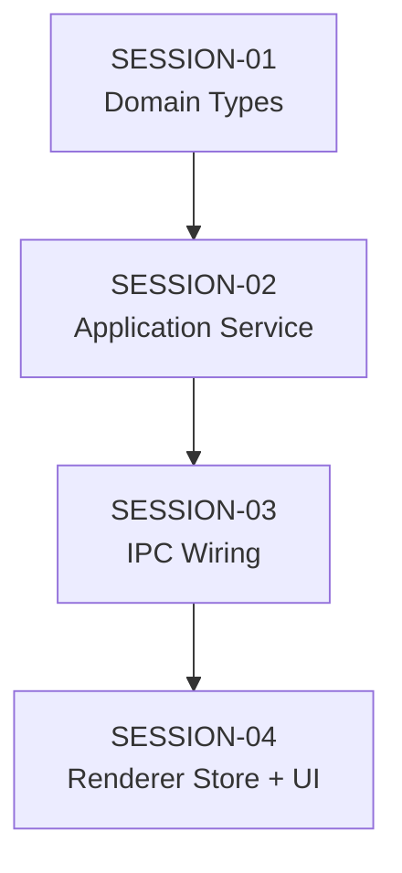

# Feature Build — State Tracker (import-series)

> Generated from intake documents on 2026-03-28.
> This file tracks progress across all session prompts.
> Updated by the agent at the end of each session execution.

---

## Feature

**Name:** import-series
**Intent:** Allow importing multiple manuscript files at once and grouping them as volumes in a new or existing series.
**Source documents:** `prompts/feature-requests/import-series.md`
**Sessions generated:** 4

---

## Status Key

- `pending` — Not started
- `in-progress` — Started but not verified
- `done` — Completed and verified
- `blocked` — Cannot proceed (see notes)
- `skipped` — Intentionally skipped (see notes)

---

## Session Status

| # | Session | Layer(s) | Status | Completed | Notes |
|---|---------|----------|--------|-----------|-------|
| 1 | SESSION-01 — Domain Types for Series Import | Domain | done | 2026-03-28 | Clean insertion. Types placed after ImportResult, interface after ISeriesService. |
| 2 | SESSION-02 — SeriesImportService | Application | done | 2026-03-28 | Implemented exactly per spec. Depends on IManuscriptImportService + ISeriesService via DI. |
| 3 | SESSION-03 — IPC Wiring, Preload, Composition Root | IPC / Main | done | 2026-03-28 | 3 new IPC channels, preload bridge namespace, composition root wiring. |
| 4 | SESSION-04 — Renderer Store and UI Components | Renderer | done | 2026-03-28 | Store, wizard, volume list, BookSelector integration. All per spec. |

---

## Dependency Graph

- Strictly linear dependency chain. Each session depends on the previous one.
- No parallelism possible — each layer depends on the one above it.

---

## Scope Summary

### Domain Changes
- New types: `SeriesImportVolume`, `SeriesImportPreview`, `SeriesImportCommitConfig`, `SeriesImportResult`
- New interface: `ISeriesImportService`

### Infrastructure Changes
- None — reuses existing `ManuscriptImportService` and `SeriesService`

### Application Changes
- New service: `SeriesImportService` — orchestrates batch import + series creation

### IPC Changes
- New channels: `import:selectFiles`, `import:seriesPreview`, `import:seriesCommit`
- New preload bridge namespace: `window.novelEngine.seriesImport`

### Renderer Changes
- New store: `seriesImportStore.ts`
- New components: `ImportSeriesWizard.tsx`, `VolumePreviewList.tsx`
- Modified: `BookSelector.tsx` — "Import Series" button + wizard rendering

### Database Changes
- None

---

## Design Decisions

| Decision | Rationale |
|----------|-----------|
| New service (`SeriesImportService`) vs. extending `ManuscriptImportService` | Orthogonal concern — series import orchestrates multiple single-book imports. `ManuscriptImportService` stays focused on individual files. |
| Sequential book creation (not parallel) | Avoids filesystem contention, simpler error handling, and series volume ordering depends on sequential commits. |
| No rollback on partial failure | If book 3 of 5 fails, books 1-2 remain. User gets value from successful imports. Full rollback would be complex and destructive. |
| Common-prefix series name detection | Handles "Series Name: Book 1" / "Series Name: Book 2" patterns naturally. Falls back to parent directory name, then "Imported Series". |
| Separate preload namespace (`seriesImport`) | Keeps the `import` namespace clean. Series import has different return types and flow. |
| No source generation step in series import wizard | Source generation is per-book and can take 10+ minutes per volume. User can run it individually after import. Keeps the import flow fast. |

---

## Handoff Notes

> Agents write freeform notes here after each session to communicate context to the next run.

### Last completed session: SESSION-04 (FINAL)

### Observations:
- Types inserted at line 637 of types.ts, between ImportResult and SourceGenerationStep sections
- ISeriesImportService interface added at end of interfaces.ts after ISeriesService
- SeriesImportService composes IManuscriptImportService + ISeriesService via DI
- 3 new IPC channels: import:selectFiles, import:seriesPreview, import:seriesCommit
- Preload bridge exposes window.novelEngine.seriesImport namespace
- BookSelector now has 3 action buttons: New Book, Import, Import Series
- `npx tsc --noEmit` passes cleanly on all 4 sessions
- Feature complete — all sessions done

### Warnings:
