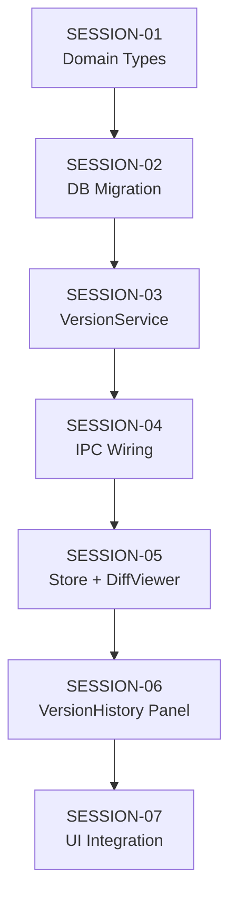

# Feature Build — State Tracker (content-version-control)

> Generated from intake documents on 2026-03-28.
> This file tracks progress across all session prompts.
> Updated by the agent at the end of each session execution.

---

## Feature

**Name:** content-version-control
**Intent:** Add version history, human-readable diffs, and revert capability for all `.md` and `.json` files surfaced in the UI.
**Source documents:** `prompts/feature-requests/content-version-control.md`
**Sessions generated:** 7

---

## Status Key

- `pending` — Not started
- `in-progress` — Started but not verified
- `done` — Completed and verified
- `blocked` — Cannot proceed (see notes)
- `skipped` — Intentionally skipped (see notes)

---

## Session Status

| # | Session | Layer(s) | Status | Completed | Notes |
|---|---------|----------|--------|-----------|-------|
| 1 | SESSION-01 — Domain Types & Interface | Domain | done | 2026-03-28 | Clean implementation, no complications. Types placed after FileEntry section as specified. |
| 2 | SESSION-02 — Database Migration & Version Repository | Infrastructure | done | 2026-03-28 | Migration v2 added, 7 new methods + 2 private mappers in DatabaseService, 7 new methods in IDatabaseService. |
| 3 | SESSION-03 — Install diff Package & VersionService | Application | done | 2026-03-28 | diff + @types/diff installed. VersionService implements all 8 IVersionService methods. |
| 4 | SESSION-04 — IPC Wiring, Preload Bridge & Composition Root (multi-book safe) | IPC / Main | pending | | |
| 5 | SESSION-05 — Version Store & DiffViewer Component | Renderer | pending | | |
| 6 | SESSION-06 — VersionHistory Panel Component | Renderer | pending | | |
| 7 | SESSION-07 — Integrate Version History into FilesView & FileEditor | Renderer | pending | | |

---

## Dependency Graph

- Strictly sequential: each session depends on the previous one.
- No parallelism possible — each layer builds on the one below it.

---

## Scope Summary

### Domain Changes
- New types: `FileVersionSource`, `FileVersion`, `FileVersionSummary`, `DiffLineType`, `DiffLine`, `DiffHunk`, `FileDiff`
- New interface: `IVersionService`
- Extended interface: `IDatabaseService` (7 new methods for version CRUD)

### Infrastructure Changes
- `src/infrastructure/database/migrations.ts` — Migration v2: `file_versions` table
- `src/infrastructure/database/DatabaseService.ts` — 7 new prepared statements and methods

### Application Changes
- New service: `src/application/VersionService.ts`

### IPC Changes
- New channels: `versions:getHistory`, `versions:getVersion`, `versions:getDiff`, `versions:revert`, `versions:getCount`, `versions:snapshot`
- Modified channel: `files:write` (adds auto-snapshot after write)
- New preload bridge namespace: `window.novelEngine.versions`

### Renderer Changes
- New store: `src/renderer/stores/versionStore.ts`
- New components: `DiffViewer.tsx`, `VersionHistoryPanel.tsx`
- Modified components: `FileEditor.tsx`, `FilesView.tsx`, `SourcePanel.tsx`, `ChaptersPanel.tsx`, `AgentOutputPanel.tsx`

### Database Changes
- New table: `file_versions` (id, book_slug, file_path, content, content_hash, byte_size, source, created_at)
- New indexes: `idx_file_versions_lookup`, `idx_file_versions_hash`

---

## Design Decisions

| Decision | Rationale |
|----------|-----------|
| Snapshot-per-write model (full content, not deltas) | Simpler to implement, no dependency chain between versions, straightforward revert. Storage cost is acceptable — text files are small and SQLite compresses well. |
| SHA-256 dedup | Prevents redundant snapshots when a file is written with identical content. Cheap to compute. |
| `diff` npm package for diff computation | Standard, well-maintained, produces structured patches compatible with unified diff format. No need to reinvent diff algorithms. |
| New `IVersionService` interface (not extending existing services) | Versioning is orthogonal to file I/O and database operations. Separate service follows single-responsibility principle. |
| Multi-level auto-snapshot (IPC handlers + BookWatcher fallback) | Primary capture at stream-completion level (`chat:send`, `hot-take`, `adhoc-revision`, revision queue) where we have the correct `bookSlug` for any book. `BookWatcher` is a fallback for external edits — it only watches the active book. This ensures writes to non-active books during concurrent CLI streams are captured. |
| Pruning at startup (keep 50 per file) | Prevents unbounded storage growth. 50 versions per file is generous for typical usage patterns. |
| Split-panel UI (editor left, history right) | History is context-dependent — you want to see the file while browsing its history. Slide-over panel is less disruptive than a full-page navigation. |
| History icons on hover in file browsers | Non-intrusive — doesn't clutter the UI but is discoverable. Consistent with existing patterns in the file tree. |

---

## Handoff Notes

> Agents write freeform notes here after each session to communicate context to the next run.

### Last completed session: SESSION-03

### Observations:
- SESSION-01: Domain types and IVersionService interface added cleanly
- SESSION-02: Migration v2, 7 new DB methods, private mappers
- SESSION-03: `diff` + `@types/diff` installed. `VersionService` created with DI on `IDatabaseService` + `IFileSystemService`. Uses `node:crypto` for SHA-256 hashing and `diff.structuredPatch` for structured diff output. Filters to `.md`/`.json` only. Revert always creates a snapshot (bypasses dedup).
- Next session (SESSION-04) should wire VersionService into composition root, add IPC handlers and preload bridge

### Warnings:
