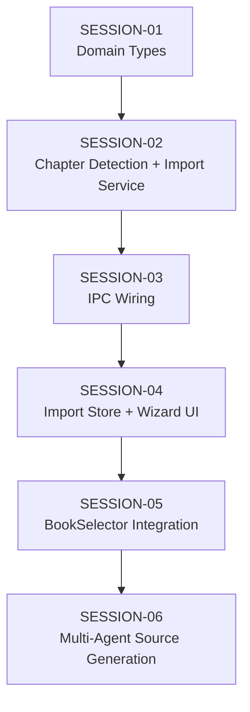

# Feature Build — State Tracker (manuscript-import)

> Generated from intake documents on 2026-03-28.
> This file tracks progress across all session prompts.
> Updated by the agent at the end of each session execution.

---

## Feature

**Name:** manuscript-import
**Intent:** Import an existing manuscript (Markdown or DOCX file) into Novel Engine, split it into chapters, set up the full book structure, and optionally generate source documents via AI — so users can enter the editorial pipeline without starting from scratch with Spark.
**Source documents:** `prompts/feature-requests/manuscript-import.md`
**Sessions generated:** 6

---

## Status Key

- `pending` — Not started
- `in-progress` — Started but not verified
- `done` — Completed and verified
- `blocked` — Cannot proceed (see notes)
- `skipped` — Intentionally skipped (see notes)

---

## Session Status

| # | Session | Layer(s) | Status | Completed | Notes |
|---|---------|----------|--------|-----------|-------|
| 1 | SESSION-01 — Domain Types & Interface | Domain | pending | | |
| 2 | SESSION-02 — Chapter Detection & ManuscriptImportService | Application | pending | | |
| 3 | SESSION-03 — IPC Wiring, Preload & Composition Root | IPC / Main | pending | | |
| 4 | SESSION-04 — Import Store & Import Wizard UI | Renderer | pending | | |
| 5 | SESSION-05 — BookSelector Integration & Polish | Renderer | pending | | |
| 6 | SESSION-06 — Multi-Agent Source Document Generation | Domain, Application, IPC, Renderer | pending | | |

---

## Dependency Graph

- Strictly sequential: each session depends on the previous one.
- No parallelism possible — each layer builds on the one below it.

---

## Scope Summary

### Domain Changes
- New types: `ImportSourceFormat`, `DetectedChapter`, `ImportPreview`, `ImportCommitConfig`, `ImportResult`, `SourceGenerationStep`, `SourceGenerationEvent`
- New interfaces: `IManuscriptImportService`, `ISourceGenerationService`

### Infrastructure Changes
- None — the import service uses existing `IFileSystemService` and the bundled Pandoc binary

### Application Changes
- New service: `ManuscriptImportService` (implements `IManuscriptImportService`)
- New service: `SourceGenerationService` (implements `ISourceGenerationService`)
- New utility: `import/ChapterDetector.ts` (pure chapter break detection)

### IPC Changes
- New channels: `import:selectFile`, `import:preview`, `import:commit`, `import:generateSources`
- New push event: `import:generationProgress`
- New preload bridge namespace: `window.novelEngine.import`

### Renderer Changes
- New store: `importStore`
- New components: `Import/ImportWizard.tsx`, `Import/ChapterPreviewList.tsx`
- Modified component: `Sidebar/BookSelector.tsx` (adds Import button)

### Database Changes
- None

---

## Design Decisions

| Decision | Rationale |
|----------|-----------|
| Use Pandoc for DOCX→MD conversion instead of adding `mammoth` | Pandoc is already bundled in the app. Avoids a new dependency. The conversion path mirrors what BuildService already does. |
| Chapter detection is a pure utility, not a service | No infrastructure dependencies. Pure function makes it testable and composable. Lives in `src/application/import/` as a utility module. |
| 3-chapter minimum for heading/pattern detection | Avoids false positives from documents with a title heading + one section heading. Falls back to single-chapter import for short/unstructured manuscripts. |
| Multi-agent source generation as a separate service | Single-prompt approach is fragile for generating 4-5 files. Dedicated `SourceGenerationService` runs 4 sequential agent calls (Spark pitch, Verity outline+bible, Verity voice, Verity motif) with per-step progress. Follows `RevisionQueueService` pattern. |
| Book status set to `'first-draft'` after import | The pipeline phase `first-draft` completes when status advances past first-draft stage. Setting status to `'first-draft'` means the book enters the pipeline at the right point for editorial review. |
| Import wizard is a modal, not a view | Import is a transient workflow — the user picks a file, reviews chapters, commits, and is done. A modal is more appropriate than a full view that occupies the content area. |

---

## Handoff Notes

> Agents write freeform notes here after each session to communicate context to the next run.

### Last completed session: (none yet)

### Observations:

### Warnings:
