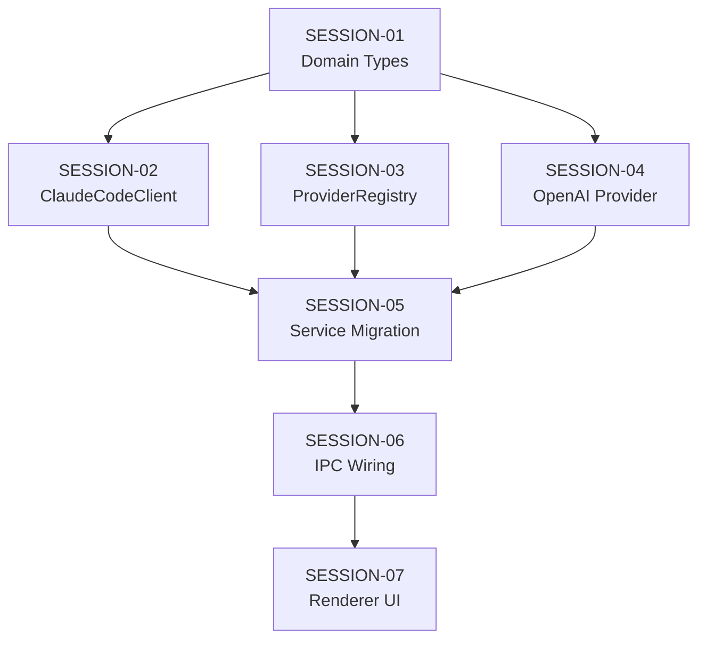

# Feature Build — State Tracker (multi-model-providers)

> Generated from intake documents on 2026-03-28.
> This file tracks progress across all session prompts.
> Updated by the agent at the end of each session execution.

---

## Feature

**Name:** multi-model-providers
**Intent:** Abstract the AI backend from Claude CLI into a pluggable provider architecture supporting Claude CLI (primary), OpenAI-compatible APIs (BYOK, self-hosted), and future CLI backends.
**Source documents:** `prompts/feature-requests/multi-model-mode.md`
**Sessions generated:** 7

---

## Status Key

- `pending` — Not started
- `in-progress` — Started but not verified
- `done` — Completed and verified
- `blocked` — Cannot proceed (see notes)
- `skipped` — Intentionally skipped (see notes)

---

## Session Status

| # | Session | Layer(s) | Status | Completed | Notes |
|---|---------|----------|--------|-----------|-------|
| 1 | SESSION-01 — Domain Types & Interfaces | Domain | done | 2026-03-28 | Moved AVAILABLE_MODELS and provider constants before DEFAULT_SETTINGS to avoid forward-reference errors. |
| 2 | SESSION-02 — ClaudeCodeClient Implements IModelProvider | Infrastructure | done | 2026-03-28 | Purely additive — no behavioral changes. |
| 3 | SESSION-03 — ProviderRegistry Infrastructure | Infrastructure | pending | | |
| 4 | SESSION-04 — OpenAI-Compatible Provider | Infrastructure | pending | | |
| 5 | SESSION-05 — Service Migration to IProviderRegistry | Application, Main | pending | | |
| 6 | SESSION-06 — IPC Channels & Preload Bridge | IPC, Preload | pending | | |
| 7 | SESSION-07 — Renderer: Provider Settings UI | Renderer | pending | | |

---

## Dependency Graph

- SESSION-01 must come first (all other sessions depend on the domain types)
- SESSION-02, 03, 04 can run in parallel after SESSION-01 (independent infra modules)
- SESSION-05 requires all three infrastructure sessions (wires them together)
- SESSION-06 requires SESSION-05 (IPC handlers need the registry)
- SESSION-07 requires SESSION-06 (UI calls through the preload bridge)

---

## Scope Summary

### Domain Changes
- New types: `ProviderId`, `ProviderType`, `ProviderCapability`, `ProviderConfig`, `ModelInfo`, `ProviderStatus`
- New interfaces: `IModelProvider`, `IProviderRegistry`
- Modified type: `AppSettings` (added `providers`, `activeProviderId`)
- New constants: `CLAUDE_CLI_PROVIDER_ID`, `OPENCODE_CLI_PROVIDER_ID`, `BUILT_IN_PROVIDER_CONFIGS`
- Deprecated: `IClaudeClient`, `AVAILABLE_MODELS`

### Infrastructure Changes
- Modified: `ClaudeCodeClient` implements `IModelProvider`
- New: `src/infrastructure/providers/ProviderRegistry.ts`
- New: `src/infrastructure/providers/OpenAiCompatibleProvider.ts`
- New: `src/infrastructure/providers/index.ts`

### Application Changes
- Modified: `ChatService`, `HotTakeService`, `PitchRoomService`, `AdhocRevisionService`, `AuditService`, `RevisionQueueService` — switch from `IClaudeClient` to `IProviderRegistry`

### IPC Changes
- New channels: `providers:list`, `providers:getConfig`, `providers:add`, `providers:update`, `providers:remove`, `providers:checkStatus`, `providers:setDefault`
- Modified: `models:getAvailable` returns `ModelInfo[]` from all providers
- New preload namespace: `window.novelEngine.providers`

### Renderer Changes
- New store: `providerStore.ts`
- New component: `ProviderSection.tsx`
- Modified: `SettingsView.tsx`

### Database Changes
- None

---

## Design Decisions

| Decision | Rationale |
|----------|-----------|
| IModelProvider mirrors IClaudeClient signatures | Minimizes migration — ClaudeCodeClient already conforms |
| IProviderRegistry as service injection point | Services don't pick providers — the registry routes by model ID |
| OpenAI-compatible as universal BYOK protocol | Covers OpenAI, Anthropic, Ollama, vLLM, LM Studio, Groq, Together, Fireworks |
| No tool-use for API providers | CLI = agent loop. API = text chat. Fundamental capability difference. |
| Configs in settings.json, not SQLite | Small, rare changes, needed before DB init |
| IClaudeClient deprecated not removed | Gradual migration, no flag day |
| fetch for HTTP (no npm deps) | Available in Node 18+ and Electron natively |

---

## Handoff Notes

### Last completed session: SESSION-02

### Observations:
- `AVAILABLE_MODELS` was reordered before `DEFAULT_SETTINGS` in constants.ts to co-locate with new provider constants and avoid forward-reference issues.
- `IClaudeClient` and `IModelProvider` have identical method signatures — ClaudeCodeClient can implement both trivially in SESSION-02.
- `ModelInfo` type does not include `ProviderId` (unused import warning avoidance) — wait, it does. The `ModelInfo.providerId` field links models to their provider.

### Warnings:
- SESSION-02, 03, 04 are all unblocked and can proceed in any order.
