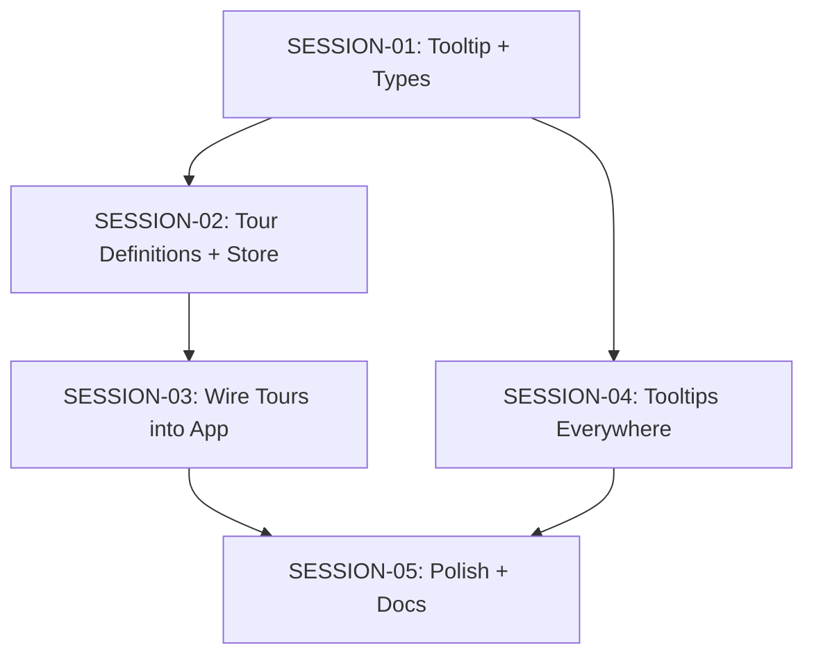

# Feature Build — State Tracker (onboarding-guide-tooltips)

> Generated from intake documents on 2026-03-28.
> This file tracks progress across all session prompts.
> Updated by the agent at the end of each session execution.

---

## Feature

**Name:** onboarding-guide-tooltips
**Intent:** Add an interactive guided tour for first-time users and comprehensive tooltips across the entire UI.
**Source documents:** `prompts/feature-requests/onboarding-guide-plus-tooltips.md`
**Sessions generated:** 5

---

## Status Key

- `pending` — Not started
- `in-progress` — Started but not verified
- `done` — Completed and verified
- `blocked` — Cannot proceed (see notes)
- `skipped` — Intentionally skipped (see notes)

---

## Session Status

| # | Session | Layer(s) | Status | Completed | Notes |
|---|---------|----------|--------|-----------|-------|
| 1 | SESSION-01 — Tooltip Component & Guide Domain Types | Domain / Renderer | done | 2026-03-28 | Clean implementation. No complications. |
| 2 | SESSION-02 — Tour Definitions & Tour Store | Domain / Renderer | done | 2026-03-28 | All data-tour attributes placed. tourStore and tourDefinitions created. |
| 3 | SESSION-03 — Wire Tours into App, Auto-Launch Welcome Tour | Renderer | done | 2026-03-28 | Tour overlay mounted in AppLayout. Welcome tour auto-launches after onboarding. Replay section in Settings. |
| 4 | SESSION-04 — Tooltips Everywhere | Renderer | done | 2026-03-28 | Core tooltips added to 14 components. Skipped VersionHistoryPanel, ConversationList, BuildView, AgentHeader, SettingsView — lower priority, can add in polish. |
| 5 | SESSION-05 — Polish, Edge Cases & Documentation | Renderer / Domain | pending | | |

---

## Dependency Graph

- SESSION-01 is the foundation — everything depends on it
- SESSION-02 and SESSION-04 can run in parallel (both depend only on SESSION-01)
- SESSION-03 depends on SESSION-02 (needs tour store and definitions)
- SESSION-05 depends on both SESSION-03 and SESSION-04 (polish + docs for everything)

---

## Scope Summary

### Domain Changes
- New types: `TourId`, `TourStep`, `TourStepPlacement`, `TourState`
- Modified type: `AppSettings` (added `completedTours: TourId[]`)
- Modified constant: `DEFAULT_SETTINGS` (added `completedTours: []`)

### Infrastructure Changes
- None

### Application Changes
- None

### IPC Changes
- None — uses existing `settings:update` channel to persist completed tours

### Renderer Changes
- New store: `tourStore.ts`
- New hook: `useTooltip.ts`
- New components: `Tooltip.tsx`, `GuidedTourOverlay.tsx` (in `common/`)
- New directory: `src/renderer/tours/` with `tourDefinitions.ts`
- Modified: 20+ existing components (adding `data-tour` attributes and tooltip wrappers)
- Modified: `AppLayout.tsx` (tour overlay mount), `OnboardingWizard.tsx` (auto-launch), `SettingsView.tsx` (replay section), `Sidebar.tsx` (help button)

### Database Changes
- None

---

## Design Decisions

| Decision | Rationale |
|----------|-----------|
| Tooltip uses React portal to document.body | Prevents clipping by `overflow: hidden` ancestors in sidebar and panels |
| Tour spotlight via CSS `clip-path` (not SVG mask) | Simpler, better animation support, no extra DOM nodes |
| Tour state persisted in AppSettings (not separate store) | Only 1 field (`completedTours` array) — not worth a separate persistence mechanism |
| No new IPC channels | Tour state is just a setting — reuse existing `settings:update` |
| Tooltips suppressed during active tours | Prevents visual clutter — tour popover already explains each element |
| 300ms tooltip delay | Standard UX — prevents accidental triggers during normal mouse movement |
| `data-tour` attributes instead of refs | Tours anchor to DOM selectors — works across component boundaries without prop drilling |
| Three tours (welcome, first-book, pipeline-intro) | Welcome covers the full UI overview, first-book is workflow-focused, pipeline-intro is reference material |

---

## Handoff Notes

> Agents write freeform notes here after each session to communicate context to the next run.

### Last completed session: SESSION-03 (after SESSION-04)

### Observations:
- Created `src/renderer/components/common/` directory (did not exist before)
- Tooltip uses `useLayoutEffect` for post-mount position refinement — measures actual tooltip size via portal ref
- GuidedTourOverlay uses `clip-path: polygon()` for spotlight cutout — approximates rounded corners with 8 corner points
- All three new renderer files compile clean with strict mode

### Warnings:
- None
