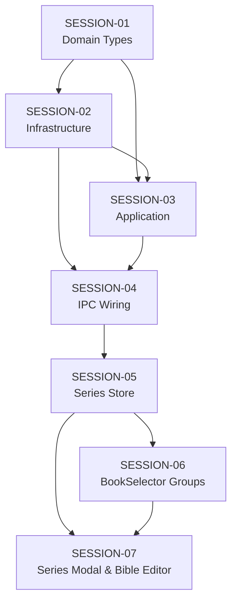

# Feature Build — State Tracker (series-bible)

> Generated from intake documents on 2026-03-28.
> This file tracks progress across all session prompts.
> Updated by the agent at the end of each session execution.

---

## Feature

**Name:** series-bible
**Intent:** Add series support — group multiple books into ordered series with a shared story bible, character registry, and timeline that persists across volumes and is automatically loaded into agent context.
**Source documents:** `prompts/feature-requests/series-bible.md`
**Sessions generated:** 7

---

## Status Key

- `pending` — Not started
- `in-progress` — Started but not verified
- `done` — Completed and verified
- `blocked` — Cannot proceed (see notes)
- `skipped` — Intentionally skipped (see notes)

---

## Session Status

| # | Session | Layer(s) | Status | Completed | Notes |
|---|---------|----------|--------|-----------|-------|
| 1 | SESSION-01 — Domain Types, Interfaces & Constants | Domain | pending | | |
| 2 | SESSION-02 — Infrastructure: SeriesService Implementation | Infrastructure | pending | | |
| 3 | SESSION-03 — Application: Series-Aware Context Building | Application | pending | | |
| 4 | SESSION-04 — IPC Wiring, Preload Bridge & Composition Root | IPC / Main | pending | | |
| 5 | SESSION-05 — Renderer: Series Store | Renderer | pending | | |
| 6 | SESSION-06 — Renderer: Series Groups in BookSelector Sidebar | Renderer | pending | | |
| 7 | SESSION-07 — Renderer: Series Management Modal & Bible Editor | Renderer | pending | | |

---

## Dependency Graph

- Sessions 1-4 are strictly sequential (each layer depends on the previous)
- Sessions 6 and 7 both depend on 5, but 7 also depends on 6 (wires the modal trigger)
- No parallel sessions — this is a linear build

---

## Scope Summary

### Domain Changes
- New types: `SeriesMeta`, `SeriesVolume`, `SeriesSummary`
- New interface: `ISeriesService`
- Updated constants: `FILE_MANIFEST_KEYS` (added `seriesBible`), `AGENT_READ_GUIDANCE` (all 7 agents)

### Infrastructure Changes
- New module: `src/infrastructure/series/` — `SeriesService.ts`, `index.ts`

### Application Changes
- Modified: `ContextBuilder.ts` — accepts `seriesBiblePath`, injects into system prompt
- Modified: `ChatService.ts` — resolves series bible path, passes to context builder

### IPC Changes
- New channels: `series:list`, `series:get`, `series:create`, `series:update`, `series:delete`, `series:addVolume`, `series:removeVolume`, `series:reorderVolumes`, `series:getForBook`, `series:readBible`, `series:writeBible`
- New preload bridge namespace: `window.novelEngine.series`

### Renderer Changes
- New store: `seriesStore.ts`
- Modified component: `BookSelector.tsx` — groups books by series
- New components: `SeriesGroup.tsx`, `SeriesModal.tsx`, `SeriesForm.tsx`, `VolumeList.tsx`, `SeriesBibleEditor.tsx`

### Database Changes
- None — series are file-based (JSON + markdown on disk)

---

## Design Decisions

| Decision | Rationale |
|----------|-----------|
| Series manifest is single source of truth (not BookMeta) | Avoids modifying BookMeta, which would require migrating all existing about.json files. Books remain self-contained — series is a pure overlay. |
| Reverse lookup cache in SeriesService | Scanning all series manifests on every `getSeriesForBook` call is O(n). Cache makes it O(1) for hot path (every chat message). Cache invalidated on mutations. |
| Single `series-bible.md` instead of separate character/timeline files | Simpler. Users can structure the document however they want with sections. Can always split into multiple files in a future feature. |
| `totalWordCount` in SeriesSummary set to 0 by infrastructure | SeriesService doesn't have access to booksDir. The renderer computes real word counts from bookStore data. Avoids cross-infrastructure coupling. |
| No drag-and-drop for volume reordering | Avoids adding a DnD library. Up/down arrow buttons are sufficient and more accessible. Can add DnD later if users request it. |
| Series directory lives in `{userData}/series/` not inside `books/` | Series are cross-book — they don't belong to any single book directory. Parallel to `custom-agents/` and `author-profile.md`. |

---

## Handoff Notes

> Agents write freeform notes here after each session to communicate context to the next run.

### Last completed session: (none yet)

### Observations:

### Warnings:
