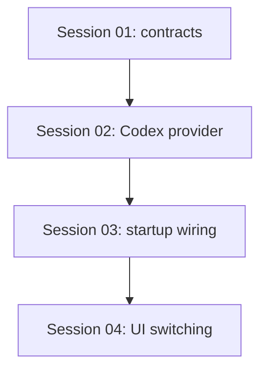

# State Tracker — Novel Engine / codex-provider-switching

## Program / Feature / Intent / Sessions

- **Program:** Novel Engine
- **Feature:** `codex-provider-switching`
- **Intent:** Make Codex CLI a first-class built-in provider so users can switch at will between Codex, Claude CLI, Ollama, and llama-server from Settings.
- **Sessions:** 4

## Session Status

| # | Session | Modules | Status | Completed | Notes |
|---|---------|---------|--------|-----------|-------|
| 01 | Domain, settings, IPC surface for Codex detection | `M01`, `M02`, `M09` | done | 2026-07-02 | Added `detectCodexCli` contract, SettingsService probe, IPC/preload bridge, and settings store action. Verification: `npx tsc --noEmit`; `grep -R "settings:detectCodexCli\|detectCodexCli" -n ./src`; renderer Node API import check. |
| 02 | Codex CLI provider implementation | `M06`, `M08` | done | 2026-07-02 | Added `CodexCliClient` and `codex-cli` barrel. Chosen command: `codex exec --json --sandbox workspace-write --skip-git-repo-check --cd <workingDir> --add-dir <booksDir> -`. Verification: `npx tsc --noEmit`; smoke `codex exec --json --skip-git-repo-check --sandbox read-only --cd <tmp> -` returned `OK` with `turn.completed.usage`. |
| 03 | Register Codex and model discovery at startup | `M09`, `M06`, `M08` | done | 2026-07-02 | Registered `CodexCliClient` in the composition root. Model discovery uses `~/.codex/models_cache.json` when parseable, then falls back to built-in `gpt-5.3-codex`. Verification: `npx tsc --noEmit`; `npm run build` unavailable (missing script); `npm run ci-build` passed. |
| 04 | Provider switching UI polish and onboarding copy | `M10`, `M09` | pending |  | Makes all four built-ins clearly selectable/testable. |

(Status: pending | in-progress | done | blocked | skipped)

## Dependency Graph

## Architecture Reference

- **Domain (`M01`)** remains pure TypeScript.
- **Infrastructure (`M02`, provider infra)** implements CLI detection and provider execution.
- **Main/IPC (`M09`)** exposes detection/configuration through thin handlers.
- **Renderer (`M10`)** only calls `window.novelEngine.*`.
- **Composition root:** `src/main/index.ts` remains the only place provider concrete classes are instantiated.

## Scope Summary

| Module | Scope |
|--------|-------|
| `M01` domain | Extend `ISettingsService` with Codex detection; verify existing `ProviderType`, `hasCodexCli`, and `CODEX_CLI_PROVIDER_ID`. |
| `M02` settings | Add `SettingsService.detectCodexCli()` using non-interactive `codex --version` or discovered equivalent. |
| `M06` provider infrastructure | Add `src/infrastructure/codex-cli/` provider implementing `IModelProvider`. |
| `M09` main/ipc/preload | Add `settings:detectCodexCli`; register `CodexCliClient`; discover models; persist availability. |
| `M10` renderer | Show Codex as a built-in provider with status, test, docs/help copy, and provider switching clarity. |

## Design Decisions

- **Codex as built-in provider:** Use existing `CODEX_CLI_PROVIDER_ID` and `BUILT_IN_PROVIDER_CONFIGS` instead of a user-created OpenAI-compatible provider.
- **Provider switching source of truth:** Keep `settings.activeProviderId` and `settings.model` synchronized through existing provider/model controls.
- **CLI probing:** Use non-interactive checks only. Never run interactive login/setup commands from Electron.
- **Model discovery:** Prefer Codex config/cache if available; fall back to a small static model list only if no cache/help-derived model list exists.
- **"lamma" interpretation:** Treat as `llama-server`, because `LLAMA_SERVER_PROVIDER_ID` and `LlamaServerClient` already exist.

## Handoff Notes

- Session 01 completed on 2026-07-02. Codex detection uses only `codex --version` with a 10s timeout and persists `hasCodexCli` true/false via `SettingsService.update()`.
- Verification passed: `npx tsc --noEmit`; `grep -R "settings:detectCodexCli\|detectCodexCli" -n ./src`; no renderer Node API imports found.
- Session 02 completed on 2026-07-02. `CodexCliClient` invokes `codex exec --json` over stdin, parses `item.completed` assistant messages, uses `turn.completed.usage`, and falls back to token estimates when structured usage is absent.
- Verification passed: `npx tsc --noEmit`; Codex smoke command returned `OK`; process maps are deleted in `abortStream()` and close cleanup paths.
- Session 03 completed on 2026-07-02. Startup now registers Codex as a built-in provider, persists `hasCodexCli`, and skips Codex in the later user-provider loop.
- Model discovery uses defensive parsing of `~/.codex/models_cache.json`; if absent or empty, the built-in config provides `gpt-5.3-codex`.
- Verification passed: `npx tsc --noEmit`; `npm run ci-build`. `npm run build` is listed in Forge instructions but missing from `package.json`.
- Next eligible session: Session 04 — Provider switching UI polish and onboarding copy.
- Agents executing sessions must follow `AGENTS.MD`: append `CHANGELOG.md` every session and update only affected `docs/architecture/*.md` files after reading actual changed files.
