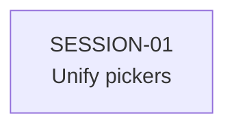
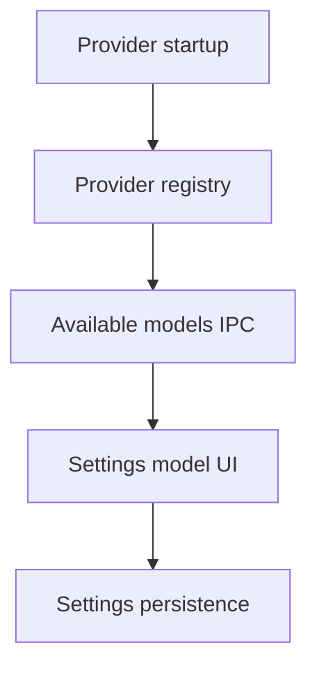

# State Tracker — Novel Engine / installed-cli-model-selection

## Program / Feature / Intent / Sessions

- **Program:** Novel Engine
- **Feature:** installed-cli-model-selection
- **Intent:** Make primary and secondary model pickers show the same available model list, based on installed/reachable CLI providers.
- **Sessions:** 1

## Session Status

| # | Session | Modules | Status | Completed | Notes |
|---|---------|---------|--------|-----------|-------|
| 01 | Unify Primary and Secondary Model Pickers | `M01`, `M08`, `M09`, `M10` | done | 2026-07-02 | Settings primary/secondary pickers now use the same available-provider model groups. AuditService now routes secondaryModel through IProviderRegistry before fallback. Verification: `npx tsc --noEmit` passed; `npm run lint` passed; `npm run build` unavailable (package has no build script). |

## Dependency Graph

## Architecture Reference

Full program architecture is in `./FORGE-CONFIG.md`.

Feature-specific path:

## Scope Summary

| Module | Scope |
|--------|-------|
| `M01` domain | Read `AppSettings.secondaryModel` and `ModelInfo`; no expected type changes. |
| `M08` application | Verify audit/secondary model uses provider registry; no expected service changes. |
| `M09` main/ipc | Verify `settings:getAvailableModels` is the installed/reachable provider source; no expected IPC changes. |
| `M10` renderer | Update `SettingsView.tsx` so primary and secondary lists are identical available-provider lists. |

## Design Decisions

- **Single source of truth:** Both pickers consume `window.novelEngine.models.getAvailable()`.
- **Provider-neutral secondary model:** `secondaryModel` can be any available model, not just Claude CLI.
- **Primary selection still controls active provider:** Primary changes preserve existing active-provider switching behavior.
- **Secondary selection does not switch active provider:** Secondary remains a lightweight/audit setting only.

## Handoff Notes

- SESSION-01 completed on 2026-07-02.
- `src/renderer/components/Settings/SettingsView.tsx` now renders Primary Model and Secondary Model through one grouped-model helper fed by `window.novelEngine.models.getAvailable()`.
- Primary model selection still calls `providers.setDefault()` when the provider changes; secondary model selection only persists `secondaryModel`.
- `src/application/AuditService.ts` previously used `secondaryModel` only when the active primary provider was Claude CLI. It now resolves `secondaryModel` through `IProviderRegistry`, so Codex/Ollama/llama-server secondary selections can run chapter audits if registered.
- Manual UI checks were not run in this headless session. Re-check providers or restart the app if newly installed CLIs/endpoints are not yet reflected in `models.getAvailable()`.
