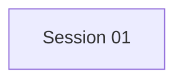

# State Tracker — Novel Engine / codex-add-dir-compatibility

## Program

Novel Engine

## Feature

Codex CLI `--add-dir` compatibility

## Intent

Fix Codex provider chat failures on installations where `codex exec` rejects the `--add-dir` flag by detecting support and falling back safely.

## Sessions

| # | Session | Modules | Status | Completed | Notes |
|---|---------|---------|--------|-----------|-------|
| 01 | Make Codex CLI `--add-dir` Compatible | `M06` | done | 2026-07-02 | Local `codex exec --help` reports `--add-dir`; `npx tsc --noEmit` and `npm run lint` passed. |

## Dependency Graph

## Architecture Reference

Full architecture rules live in `FORGE-CONFIG.md`.

Feature-specific constraints:

- Keep changes inside `src/infrastructure/codex-cli/CodexCliClient.ts` plus required docs.
- Preserve Clean Architecture direction: infrastructure may import domain, Node built-ins, and npm packages only.
- Do not change renderer, IPC, application services, or domain contracts.

## Scope Summary

| Module ID | Module | Scope |
|-----------|--------|-------|
| `M06` | codex-cli | Conditional `--add-dir` argument support for `codex exec`. |

## Design Decisions

| Decision | Rationale |
|----------|-----------|
| Detect support via `codex exec --help` | Compatible with old/new CLI versions without hard-coding version strings. |
| Cache detection per client instance | Avoids spawning `codex exec --help` on every argument branch after first request. |
| Fall back by omitting `--add-dir` | Prevents immediate CLI failure; workspace remains usable under `--cd`. |
| Warn when fallback narrows access | Operators need visibility if a task may not access sibling book directories. |

## Handoff Notes

Agents should append session results here after execution.

### 2026-07-02 — SESSION-01

- Built cached Codex CLI `--add-dir` support detection in `src/infrastructure/codex-cli/CodexCliClient.ts`.
- `CodexCliClient.sendMessage()` now includes `--add-dir <booksDir>` only when `codex exec --help` advertises the flag.
- Unsupported installs fall back to `--cd`-scoped workspace access and log a main-process warning when that narrows access.
- Local `codex exec --help` includes `--add-dir`.
- Verification: `npx tsc --noEmit` passed; `npm run lint` passed; `npm run build` could not run because `package.json` has no `build` script.
