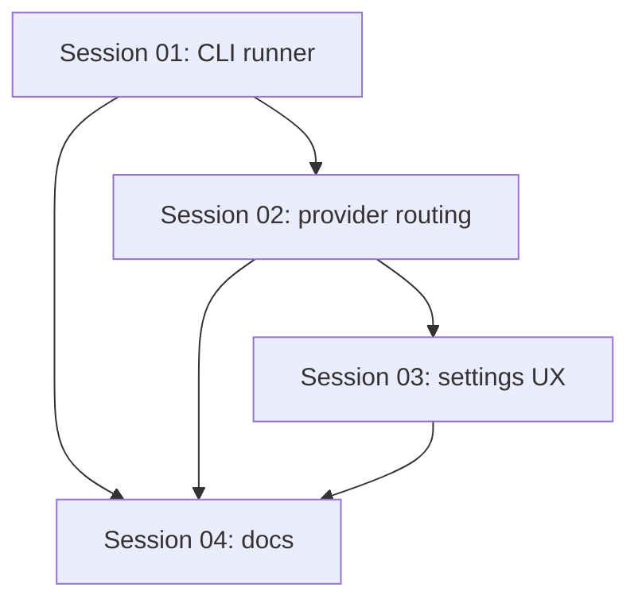

# State Tracker — Novel Engine / ollama-cli-first-experience

## Program

**Program:** Novel Engine  
**Feature:** ollama-cli-first-experience  
**Intent:** Make the built-in Ollama provider CLI-first for detection, model discovery, local startup, and settings UX while retaining API chat only where required for streaming tool-use.

## Sessions

| # | Session | Modules | Status | Completed | Notes |
|---|---------|---------|--------|-----------|-------|
| 01 | Add Ollama CLI runner | M06, M01 | done | 2026-07-02 | Added `OllamaCliRunner` plus exports and documentation. Parser skips the standard `NAME ID SIZE MODIFIED` header, treats the first whitespace column as the model name, and returns empty/false on missing CLI. |
| 02 | Route Ollama availability and model discovery through CLI | M06, M09 | done | 2026-07-02 | Wired `OllamaCliRunner` into `OllamaCodeClient` and startup model discovery. Local CLI presence and `ollama list` verified; remote endpoint behavior kept HTTP-only by code path but not manually exercised. |
| 03 | Update provider settings UX for CLI-first Ollama | M09, M10 | pending |  | Clarify endpoint as optional/advanced and expose CLI-backed status/test behavior through existing IPC. |
| 04 | Documentation and verification | Docs | pending |  | Update mandatory changelog plus affected architecture docs after implementation sessions. |

## Dependency Graph

## Architecture Reference

Full registry lives in `./FORGE-CONFIG.md`.

Feature scope:

| ID | Module | Scope |
|----|--------|-------|
| M01 | domain | Add only if a provider setting/type is required; prefer no domain change unless storing CLI mode is necessary. |
| M06 | claude-cli / ollama-cli infra | Add `OllamaCliRunner`; adapt `OllamaCodeClient` to use it for local availability and readiness. |
| M09 | main/ipc | Replace duplicated startup model discovery with shared CLI-first helpers; keep IPC thin. |
| M10 | renderer | Update Settings copy and status behavior for a CLI-first local Ollama experience. |

## Scope Summary

### In Scope

- Detect local Ollama via `ollama --version` / `ollama list` instead of API-only reachability.
- Use CLI for local model discovery: `ollama list` and `ollama show` where practical.
- Optionally start local Ollama service with `ollama serve` when the CLI exists but `127.0.0.1:11434` is not reachable.
- Preserve current `/api/chat` streaming and tool-use implementation because current Ollama tool-calling docs use API/SDK tool schemas.
- Settings UX should say endpoint is optional/advanced, not the primary path.

### Out of Scope

- Replacing tool-use streaming with raw `ollama run`; the CLI is interactive and does not expose the current structured tool-call stream needed by `ToolExecutor`.
- Remote Ollama removal. Remote endpoints should still work when a base URL is explicitly configured.
- New model/provider architecture beyond Ollama.

## Design Decisions

| Decision | Rationale |
|----------|-----------|
| CLI-first, API-for-chat hybrid | `ollama list`, `ollama show`, `ollama serve`, and `ollama run` provide the local CLI experience. `/api/chat` remains the reliable structured streaming/tool-call path. |
| Add a dedicated runner | Avoids command parsing and process lifecycle logic inside `./src/main/index.ts` or `./src/infrastructure/ollama-cli/OllamaCodeClient.ts`. |
| Do not add a new provider type | The existing `ollama-cli` type already names the intended experience. Changing IDs/types would create migration churn. |
| Keep remote endpoint support | Existing settings and users may depend on `baseUrl`; treat it as advanced override. |

## Handoff Notes

- SESSION-01 completed on 2026-07-02. `./src/infrastructure/ollama-cli/OllamaCliRunner.ts` now centralizes `ollama` command detection, `list` parsing, `show` context probing, `serve` lifecycle management, and `run` smoke tests.
- `OllamaCliRunner.listModels()` assumes standard Ollama CLI columns where `NAME` is the first whitespace-delimited field; it prefers padded columns for `ID`, `SIZE`, and `MODIFIED`, with a whitespace fallback.
- SESSION-02 completed on 2026-07-02. `./src/infrastructure/ollama-cli/OllamaCodeClient.ts` now uses local CLI-first availability, attempts `ollama serve`, and checks local API readiness before `/api/chat`.
- `./src/main/index.ts` now creates one `OllamaCliRunner`, injects it into `OllamaCodeClient`, uses CLI model discovery for local endpoints, and preserves HTTP discovery for remote/non-local Ollama base URLs.
- Verification: `npx tsc --noEmit`, `npm run lint`, and `ollama list` passed. `npm run build` is unavailable because `./package.json` has no `build` script. Manual app streaming was not run.
- Agents implementing sessions must follow `./AGENTS.MD`: append `./CHANGELOG.md` every code-changing session and update only affected files in `./docs/architecture/`.
