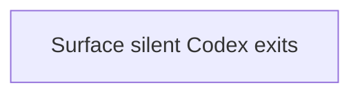

# State Tracker — Novel Engine / fix-codex-silent-exit

## Program

Novel Engine — `/Users/the.phoenix/WebstormProjects/novel-engine/`

## Feature

fix-codex-silent-exit

## Intent

When the selected Codex CLI provider quits quickly without producing assistant output, Novel Engine must surface an actionable error instead of silently treating the run as successful.

## Sessions

1 session.

## Session Status

| # | Session | Modules | Status | Completed | Notes |
|---|---------|---------|--------|-----------|-------|
| 01 | Surface silent Codex CLI exits as errors | M13, M08 | done | 2026-07-08 | `npx tsc --noEmit` passed. No-output Codex exits now emit diagnostic `error`; text-without-usage still gets synthetic `done`. |

## Dependency Graph

## Architecture Reference

`./FORGE-CONFIG.md` does not yet list the post-provider-split modules separately. This feature touches the existing Codex provider implementation:

| ID | Module | Path | Owns | Imports From | Key Files |
|----|--------|------|------|-------------|-----------|
| M13 | codex-cli | `./src/infrastructure/codex-cli/` | Spawns `codex exec`, parses JSONL, maps process lifecycle to `StreamEvent` | M01, M03 | `./src/infrastructure/codex-cli/CodexCliClient.ts` |
| M08 | application | `./src/application/` | Stream lifecycle cleanup and message persistence | M01 | `./src/application/StreamManager.ts` |

## Scope Summary

| Module | Files | Change Type |
|--------|-------|-------------|
| M13 codex-cli | `./src/infrastructure/codex-cli/CodexCliClient.ts` | Silent-exit diagnostics and parser hardening |
| Docs | `./docs/architecture/INFRASTRUCTURE.md`, `./CHANGELOG.md` | Required documentation for implemented source changes |

## Design Decisions

- **No-output exit is an error**: A Codex process that exits without assistant text or usage is not a valid assistant response.
- **Text-without-usage remains recoverable**: If assistant text streamed but Codex omitted a usage summary, keep the existing synthetic `done` path.
- **Diagnostics stay bounded**: Stderr/stdout tails are capped so the error is useful without flooding SQLite, IPC, or the UI.
- **No renderer changes first**: The backend already emits `error` events through `StreamManager`; only add renderer work if smoke testing shows the UI hides those errors.

## Handoff Notes

- User report captured in `./prompts/session-program/program-015/input-files/bug-report.md`.
- Local `codex --version` check on 2026-07-08 returned `codex-cli 0.142.4`.
- `codex exec --help` includes `--add-dir`; this bug is not the earlier `--add-dir` compatibility issue.
- Built `./src/infrastructure/codex-cli/CodexCliClient.ts` diagnostics: no assistant text + no usage on close now emits/rejects with a diagnostic `error`.
- Native Codex error JSON now emits `error`; close rejection reuses the captured terminal error without a duplicate UI error event.
- Verification: `npx tsc --noEmit` passed on 2026-07-08. UI smoke was not run in a live Electron session; renderer should already receive the stream `error` through `StreamManager`.
