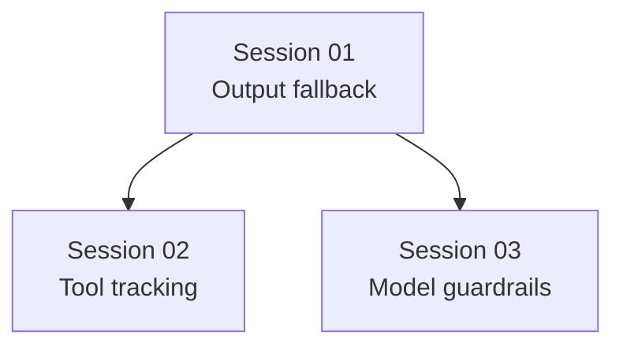

# State Tracker — Novel Engine / codex-clean-exit-recovery

## Program

**Novel Engine** — Electron + React + TypeScript desktop writing app.

## Feature

**codex-clean-exit-recovery**

## Intent

Fix Codex CLI chat failures where `codex exec --json` exits with code `0` after JSON events but Novel Engine receives no assistant output or usage.

## Sessions

| # | Session | Modules | Status | Completed | Notes |
|---|---------|---------|--------|-----------|-------|
| 01 | Codex final-output fallback + diagnostics | `M06` | done | 2026-07-08 | Added `--output-last-message`, fallback text emission, temp cleanup, and parsed event-tail diagnostics. Verified with `npx tsc --noEmit` and Codex final-message smoke test (`OK` observed). |
| 02 | Codex tool/file event tracking | `M06`, `M08` | done | 2026-07-08 | Tracks completed Codex `file_change` and tool-like items into `StreamSessionTracker`; emits progress/tool/file events. Verified with `npx tsc --noEmit`, `npm run lint`, and Codex file-write smoke test. |
| 03 | Provider model resolution guardrails | `M01`, `M08`, `M09`, `M10` | pending | — | Resolve stale model/provider settings before launch and keep UI selection coherent. |

## Dependency Graph

## Architecture Reference

- Full program config: `./FORGE-CONFIG.md`
- Input bug report: `./prompts/session-program/program-016/input-files/bug-report.md`
- Current failing path: `./src/application/ChatService.ts` → `./src/infrastructure/providers/ProviderRegistry.ts` → `./src/infrastructure/codex-cli/CodexCliClient.ts`

## Scope Summary

| Module ID | Module | Scope |
|-----------|--------|-------|
| `M01` | domain | Add model-resolution contract if needed. |
| `M06` | codex-cli | Improve final output recovery, diagnostics, and tool/file tracking. |
| `M08` | application | Use effective model IDs in ChatService stream metadata. |
| `M09` | main/ipc | Reconcile startup settings if selected model is stale. |
| `M10` | renderer | Show coherent model selection if settings reference unavailable models. |

## Design Decisions

- **Use Codex's own final-message file**: `codex exec --output-last-message` is the best fallback when JSON stdout has status/tool events but no text.
- **Keep JSON streaming primary**: Continue emitting live `textDelta` from JSON when available; only read the final-message file when no text was streamed.
- **Improve diagnostics before guessing**: Include parsed event type tail in errors so future clean exits are explainable.
- **Self-heal stale settings**: If `settings.model` is not in the provider registry, choose the active provider default/first model and persist the corrected selection.

## Handoff Notes

Agents should append notes here after each session.

### 2026-07-08 — SESSION-01 complete

- `./src/infrastructure/codex-cli/CodexCliClient.ts` now creates a temp `last-message.txt`, passes it via `--output-last-message`, reads it on clean close if no JSON text streamed, emits it as `textDelta`, and removes the temp directory during cleanup.
- Exit diagnostics now include the last 12 parsed Codex event summaries as `eventTail=...` in addition to existing stderr/stdout/status tails.
- Verification: `npx tsc --noEmit` passed. Manual Codex smoke test wrote `OK` to the final-message file. Full Electron UI chat smoke was not run in this shell session.

### 2026-07-08 — SESSION-02 complete

- `./src/infrastructure/codex-cli/CodexCliClient.ts` now parses completed Codex tool-like items and `file_change` items, normalizes absolute workspace paths to relative paths, updates `StreamSessionTracker.touchFile()`, and emits `toolUse`, zero-duration `toolDuration`, `progressStage`, `done.filesTouched`, and one terminal `filesChanged`.
- Observed Codex write event shape: `item.started` then `item.completed` with `item.type="file_change"`, `item.status="completed"`, and `item.changes=[{ path, kind:"add" }]`. The implementation tracks only completed items.
- Verification: `npx tsc --noEmit` passed. `npm run lint` passed. Manual Codex smoke test wrote `codex-tool-smoke.txt` and produced `item.completed:file_change` JSON. Full Electron pipeline UI smoke was not run in this shell session.
