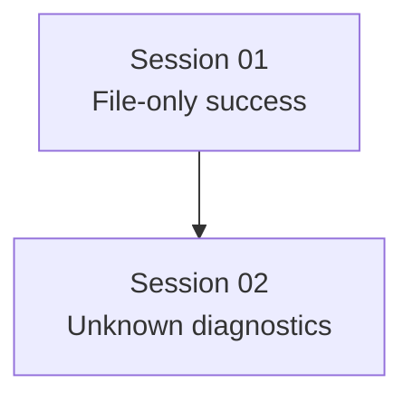

# State Tracker — Novel Engine / codex-file-only-completion

## Program

**Novel Engine** — Electron + React + TypeScript desktop writing app.

## Feature

**codex-file-only-completion**

## Intent

Fix Codex CLI auto-draft runs where `codex exec --json` exits with code `0` after writing files but emits no assistant message or usage, causing Novel Engine to show an error despite successful file output.

## Sessions

| # | Session | Modules | Status | Completed | Notes |
|---|---------|---------|--------|-----------|-------|
| 01 | Codex file-only success detection | `M06`, `M08` | done | 2026-07-08 | Added bounded workspace snapshot diff and synthetic success when clean exit writes files but no assistant text/usage. |
| 02 | Codex unknown-event diagnostics | `M06` | done | 2026-07-08 | Made Codex JSON event summaries useful when events lack current `type`/`item` shape. |

## Dependency Graph

## Architecture Reference

- Full program config: `./FORGE-CONFIG.md`
- Input bug report: `./prompts/session-program/program-017/input-files/bug-report.md`
- Current failing path: `./src/application/ChatService.ts` → `./src/infrastructure/providers/ProviderRegistry.ts` → `./src/infrastructure/codex-cli/CodexCliClient.ts` → `./src/application/StreamManager.ts`

## Scope Summary

| Module ID | Module | Scope |
|-----------|--------|-------|
| `M06` | codex-cli | Terminal close classification, file-touch fallback detection, JSON diagnostics. |
| `M08` | application | Read-only context for `StreamManager` and `ChatService` downstream behavior. |

## Design Decisions

- **File-only Codex success is valid**: A clean `exitCode=0` with file changes should complete even when Codex has no final agent message.
- **Keep no-op failures visible**: A clean `exitCode=0` with no text, no usage, and no file changes remains an error.
- **Use snapshot diff as fallback only**: Prefer parsed Codex file-change events. Use filesystem snapshot comparison to catch unknown event shapes.
- **Bound the scan**: Snapshot only file metadata, skip oversized/generated directories, and cap scan size to avoid UI stalls on large workspaces.
- **Diagnostics should explain parser misses**: Unknown event tails must include keys or small raw summaries, not just `unknown`.

## Handoff Notes

Agents should append notes here after each session.

### 2026-07-08 — SESSION-01 complete

- Changed `./src/infrastructure/codex-cli/CodexCliClient.ts` to snapshot workspace file metadata before spawning Codex, diff changed files on clean close when parsed events report no file touches, and emit a concise synthetic success for file-only clean exits.
- Updated `./docs/architecture/INFRASTRUCTURE.md`, `./docs/architecture/APPLICATION.md`, and `./CHANGELOG.md`.
- Verification passed: `npx tsc --noEmit`; `npm run lint`.
- Codex CLI smoke run completed with `codex-cli 0.142.4`; command wrote `codex-file-only-smoke.md` containing `SMOKE`.
- Electron smoke was not run.

### 2026-07-08 — SESSION-02 complete

- Changed `./src/infrastructure/codex-cli/CodexCliClient.ts` to summarize nested Codex event shapes from `msg`, `event`, and `data`, include item key summaries for untyped item records, and append bounded `unknownJsonTail` snippets to exit diagnostics.
- Updated `./docs/architecture/INFRASTRUCTURE.md` and `./CHANGELOG.md`.
- Verification passed: `npx tsc --noEmit`; `npm run lint`; `npm run package`.
- `npm run build` is listed in `./FORGE-CONFIG.md` but `./package.json` has no `build` script; `npm run package` is the available Electron Forge production build/package command and passed.
- Parser smoke passed through a transpiled local harness: nested `msg.type` summarized as `item.completed:file_change`, unknown objects summarized as `unknown{foo,bar}`, literal `type: unknown` summarized as `unknown{type,foo}`, and raw JSON snippets capped at 500 characters plus ellipsis.
